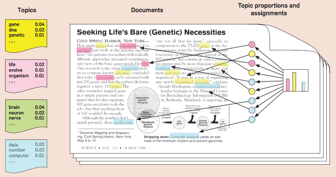
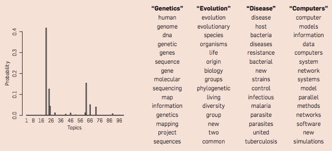
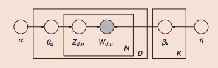

This documentation was generated to provide a summary of the LDA method. For more resources, check out:

- <https://www.cs.princeton.edu/~blei/papers/Blei2012.pdf>
- <https://www.cs.princeton.edu/~blei/papers/BleiNgJordan2003.pdf>
- <https://www.cl.cam.ac.uk/teaching/1011/L101/ml4lp-lect8.pdf>

## What is Latent Dirichlet Allocation?

Latent Dirichlet Allocation is a simple topic model, which takes a view that a document, or a collection of words, arise from a set of topics. Each word in the document is generated from a topic (based on a probability distribution), and a collection topics comprise a document (based on another probability distribution). The following images summarize the model well (The images are taken from the first reference above).

```{r, echo=FALSE}
setwd("~/Desktop/Project/tigerHack/Methods/LDA")
```




## How does the model work?

In the image above, you can see that each word in a document has a probability that it arose from a particular topic (color-coded), and that each document is generated by a set of topics that give rise to the bag of words. Another simple way to think about this model is as a generative process. A document can be generated in the following fashion:

1. Randomly choose a distribution over topics.
2. For each word, repeat:
  + Randomly choose a topic from a distribution.
  + Randomly choose a word from the topic.

Therefore, we can write down the joint probability distribution of our dataset:

$$ p(\beta_{1:K}, \theta_{1:D}, z_{1:D}, w_{1:D}) = \prod_{k=1}^{K}p(\beta_k) \prod_{d=1}^{D}p(\theta_d) \prod_{n=1}^{N}p(z_{d,n}|\theta_d)p(w_{d,n}|\beta_{1:K}, z_{1:D}) $$

Where there are $D$ documents, $K$ topics, and $N$ words. $\beta_k$ stands for a distribution of words in topic $k$, $\theta_d$ stands for distribution of topics in document $d$, $z_{d,n}$ is the assignment of topic for $n$th word in $d$th document, and $w_{d,n}$ is the actual word. The probability distribution above can also be represented as the following plate notation:



Now we can discuss why the model is called Latent Dirichlet Allocation. **Latent** comes from the fact that the topic assignments are hidden variables, and **Dirichlet** comes from the fact that the topic distribution is written down as a [Dirichlet Distribution](https://en.wikipedia.org/wiki/Dirichlet_distribution).

## What is our goal?

Our goal in this case is to infer a set of distributions, given a set of documents. In other words, we want to calculate the **conditional distribution**:

$$ p(\beta_{1:K}, \theta_{1:D}, z_{1:D} | w_{1:D}) $$

where we have a set of words as observations, and we want to infer the appropriate distributions $\beta_k,\theta_d$. This conditional distribution is also called the **posterior distribution**.

There are a set of ways to perform this inference step. Let's divide them into two large categories:

1. Sampling methods (e.g. Gibbs Sampling)
2. Variational Inference methods

**Gibbs Sampling** is the approach implemented in the R package **lda**, where a Markov chain is constructed, whose limiting distribution is the posterior. Then, successive steps sample a topic assignment based on a word from the current probability distribution, as well as topic assignments for all other words, until convergence. A more detailed description of how Gibbs Sampling works in this context is given in this [reference](http://psiexp.ss.uci.edu/research/papers/SteyversGriffithsLSABookFormatted.pdf).

**Variational Inference** works in a slightly different fashion. It is a deterministic process, where we optimize over a parametric family of distributions that fit our posterior, and try to find the distribution that is the closest to our posterior (in terms of [Kullback-Leibler divergence](https://en.wikipedia.org/wiki/Kullback%E2%80%93Leibler_divergence), for example). A more detailed description of the method is given in the second reference given in the top of this document.

## Extensions to LDA

There are several possible extensions to the LDA:

- The order of words are not exchangeable (e.g. LDA with HMM). [example](http://psiexp.ss.uci.edu/research/papers/composite.pdf)
- The observations of topics are not exchangeable (e.g. the topics could change over time). [example](http://repository.cmu.edu/cgi/viewcontent.cgi?article=2036&context=compsci)
- The number of topics are not fixed in advance (e.g. Hierarchical Dirichlet Process). [example](http://www.cs.berkeley.edu/~jordan/papers/hdp.pdf)
- Incorporating metadata, such as author list of links to other documents. [example](http://arxiv.org/pdf/1207.4169.pdf)
- Data generated from other fields, such as population genetics and computer vision [example](http://www.genetics.org/content/155/2/945.full-text.pdf+html)

